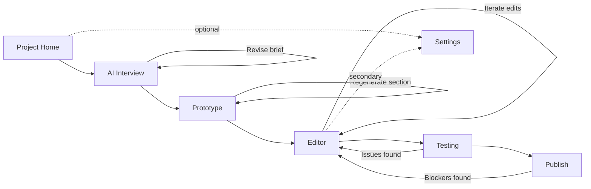

# GameForge V1 UX Wireframe Baseline

## Scope and Alignment
This baseline defines low-fidelity wireframes and navigation for V1 core screens:
- Project Home
- AI Interview
- Prototype
- Editor
- Testing
- Publish

This document is aligned with no-code-first and clarity-first principles from `GAMEFORGE_UX_FOUNDATIONS.md` and the V1 end-to-end flow in `GAMEFORGE_V1_BLUEPRINT.md`.

## Wireframe Artifacts (Low Fidelity)

Notation:
- `[Primary]` = default action for non-coders
- `[Secondary]` = useful but non-default action
- `[Advanced]` = hidden/collapsed by default

### 1) Project Home

```text
+--------------------------------------------------------------------------------+
| GameForge | Project Home                                      [Settings] [Help]|
+--------------------------------------------------------------------------------+
| [Primary] New Project   [Primary] Open Project   [Secondary] Import Project    |
+--------------------------------------------------------------------------------+
| Recent Projects                                                               |
|  - CozyTown (Prototype Ready)   [Continue]                                     |
|  - SkyGuild (Testing Needed)    [Continue]                                     |
|  - Untitled_RPG (Not Started)   [Continue]                                     |
+--------------------------------------------------------------------------------+
| Status Overview                                                                |
|  Not Started | Interview In Progress | Prototype Ready | Testing Needed | Ready|
+--------------------------------------------------------------------------------+
| Integrations                                                                   |
|  Git Sync: [OFF] (default)   [Advanced] Configure remote                        |
+--------------------------------------------------------------------------------+
```

### 2) AI Interview

```text
+--------------------------------------------------------------------------------+
| AI Interview                                                   Progress: 35%    |
+--------------------------------------------------------------------------------+
| Question Batch (3 at a time)                                                      |
|  Q1: Core fantasy?                                                                |
|  Q2: Main player goal?                                                            |
|  Q3: Session length target?                                                       |
|                                                                                   |
| [Primary] Answer and Continue   [Secondary] Skip for now   [Secondary] Save Draft|
+--------------------------------------------------------------------------------+
| Need help deciding?                                                              |
| [Primary] Suggest 3 options   [Primary] Think of something (3 directions)       |
+--------------------------------------------------------------------------------+
| Live Design Brief Summary                                                        |
| - Genre blend: RPG + Sim                                                         |
| - Core loop: Explore -> Gather -> Upgrade                                        |
| - Tone: Cozy fantasy                                                             |
| [Secondary] Edit summary                                                         |
+--------------------------------------------------------------------------------+
```

### 3) Prototype

```text
+--------------------------------------------------------------------------------+
| Prototype                                                                        |
+--------------------------------------------------------------------------------+
| Brief Status: Complete                                                           |
| [Primary] Generate Prototype                                                     |
|                                                                                  |
| Generation Progress                                                              |
| [#####-----] 50%  | Creating scene skeleton + player controller                 |
|                                                                                  |
| What was created                                                                 |
| - Scene layout                                                                   |
| - Basic movement                                                                  |
| - Placeholder UI                                                                  |
|                                                                                  |
| [Secondary] Regenerate section   [Primary] Continue refining                     |
+--------------------------------------------------------------------------------+
```

### 4) Editor (Primary Work Area)

```text
+--------------------------------------------------------------------------------+
| Editor   [Undo] [Redo] [Lock/Unlock] [Preview Changes] [Playtest]               |
+--------------------------------------------------------------------------------+
| Outliner             | Viewport (center focus)                  | Inspector      |
| - World              |                                           | [Simple]*      |
| - Player             |  Selected object highlight               |  - Name         |
| - NPC_01             |                                           |  - Position     |
| - QuestMarker        |                                           |  - Behavior     |
|                      |                                           | [Advanced] (v)  |
|                      |                                           |  - Scripting    |
|                      |                                           |  - State graph  |
+--------------------------------------------------------------------------------+
| AI Copilot (selection-aware)                                                     |
| "Make selected NPC friendlier and slow movement by 10%"                        |
| [Primary] Apply with Preview   [Secondary] Explain Change   [Secondary] Cancel  |
+--------------------------------------------------------------------------------+
*Simple tab is default; Advanced remains collapsed.
```

### 5) Testing

```text
+--------------------------------------------------------------------------------+
| Testing                                                                          |
+--------------------------------------------------------------------------------+
| Step 1: Bot Test                                                                 |
| [Primary] Run Bot Test                                                           |
|                                                                                  |
| Bot Report Cards                                                                 |
| - Gameplay: Pass                                                                  |
| - Progression: Needs Review                                                       |
| - Economy: Pass                                                                   |
| - Performance: Inconclusive (flag)                                                |
|                                                                                  |
| [Primary] Start Human Test (required when inconclusive)                          |
| [Secondary] View detailed logs                                                    |
+--------------------------------------------------------------------------------+
```

### 6) Publish

```text
+--------------------------------------------------------------------------------+
| Publish                                                                          |
+--------------------------------------------------------------------------------+
| Readiness Score: 82/100                                                          |
|                                                                                  |
| Critical Blockers (must fix first)                                               |
| - Missing required age rating metadata                                           |
|                                                                                  |
| Warnings (override allowed)                                                      |
| - Performance dips in scene 4                                                    |
| [Secondary] Override warning (requires explicit confirmation)                    |
|                                                                                  |
| Checklist                                                                         |
| [x] Build generated                                                               |
| [x] Assets licensed                                                               |
| [ ] Store metadata complete                                                       |
|                                                                                  |
| [Primary] Fix blockers   [Primary] Re-check readiness   [Secondary] Publish      |
+--------------------------------------------------------------------------------+
```

## Navigation Flow Map



## Default Layout Hierarchy (Simple First)

1. Primary actions are top-level and visually prominent (Generate, Continue, Run Bot Test, Fix Blockers).
2. Advanced capabilities are collapsed, nested, or secondary (Advanced inspector tab, Git remote config, detailed logs).
3. Core route remains linear for first-time users: **idea -> prototype -> editor -> testing -> publish**.

## UX Assumptions (V1)

1. Users are mostly first-time creators and prefer guided flow over freeform navigation.
2. A linear default journey reduces abandonment; non-linear jumps remain available as secondary actions.
3. Bot testing is mandatory before human testing to preserve no-code-first quality gates.
4. Publish should present blockers first to avoid accidental low-quality release.
5. AI change preview is required for trust and recoverability in editor changes.

## Open Questions

1. Should users be allowed to open Editor before first prototype generation (read-only vs editable)?
2. In Testing, do we require a minimum human test duration when bot results are inconclusive?
3. In Publish, should warning overrides be global or require per-warning acknowledgement?
4. How much of advanced inspector should be exposed to non-coders in V1 defaults?
5. Should Project Home expose a "Resume recommended next step" CTA based on current status badge?

## Validation Checklist

- [x] All required screens have low-fidelity wireframe artifacts.
- [x] Navigation map includes core path from idea -> prototype -> editor -> testing -> publish.
- [x] Advanced controls are secondary to simple controls in default layout.
- [x] Flows remain aligned to no-code-first constraints (plain actions, guided sequence, confirmation emphasis).
